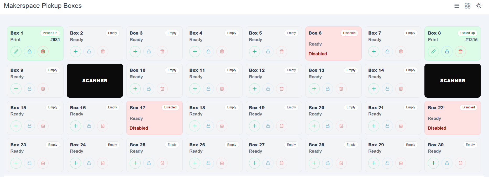
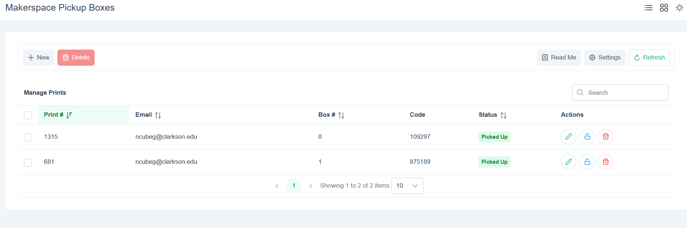
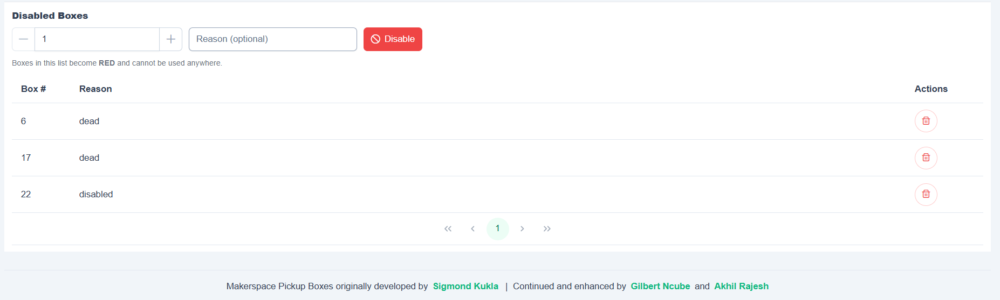
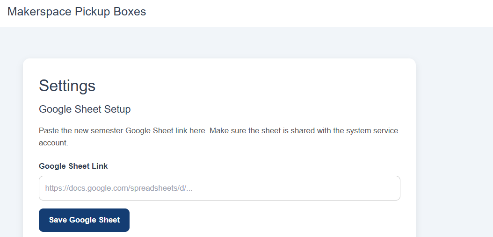
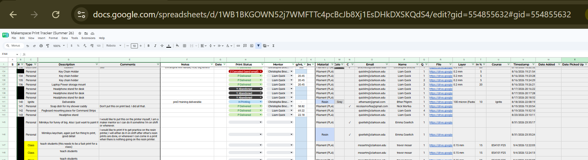
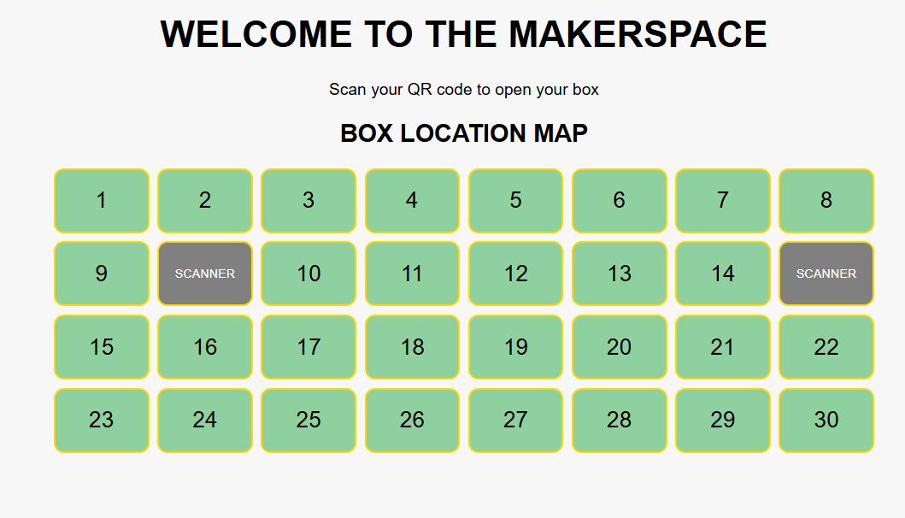
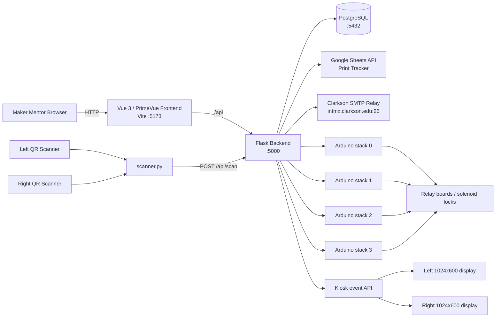

# Ignite Makerspace Pickup Boxes

A Raspberry Pi–based locker system for storing and distributing completed Makerspace prints. Maker Mentors assign a print to a locker through the web control panel; the system looks up the maker in the active Google Sheet, emails a QR pickup code, and opens the correct physical locker when that code is scanned.

**Deployed system:** `http://ignitepickupboxes.clarkson.edu/`

> The web application is the control point for the physical pickup boxes. Do not place an item into a locker until the corresponding print has been created in the system.

## Screenshots

### Box view

The recommended day-to-day view shows the physical locker layout, current status, scanner locations, and disabled lockers.



### List view

The list view provides print CRUD operations, search, manual box assignment, automatic assignment, unlock, and status management.



### Disabled boxes

Faulty lockers can be disabled with an optional reason. Disabled lockers are shown in red and cannot be assigned until re-enabled.



### Google Sheet settings

The active semester Print Tracker can be changed from the Settings page without editing the backend `.env` file.



### Print Tracker integration

The backend reads maker information from the active Google Sheet and writes pickup status/date information back to it.



### Pickup kiosk

The student-facing kiosk shows the physical locker map and directs makers to scan their QR pickup code. The two black positions correspond to the scanner locations rather than usable lockers.



For Maker Mentor operating instructions, see [Makerspace Pickup Boxes Guide](docs/Makerspace%20Pickup%20Boxes%20Guide.pdf).

---

## What the system does

The project combines a web application, PostgreSQL database, Google Sheets integration, QR-code email delivery, USB scanners, Arduino-controlled relays, and kiosk displays.

Typical workflow:

1. A Maker Mentor selects an available box and enters a print number.
2. The backend looks up the maker's name and Clarkson email address in the active Google Sheet.
3. The print is stored in PostgreSQL and associated with a logical box number.
4. The Google Sheet is updated with the box-system status and date-added value.
5. The system generates a numeric pickup code, renders it as a QR code, and emails it to the maker.
6. The mentor unlocks the assigned box, places the print inside, and closes the door.
7. The maker scans the emailed QR code at one of the physical scanners.
8. `scanner.py` forwards the code and scanner side to the Flask API.
9. The backend opens the mapped physical locker through the appropriate Arduino/relay stack.
10. The kiosk display shows the maker which box opened, and the database/Google Sheet are updated.

---

## Features

- Visual **Box View** matching the physical locker arrangement
- Traditional **List View** for print management
- Automatic Google Sheet lookup by print number
- Automatic Clarkson email lookup and maker-name lookup
- QR-code pickup emails through the Clarkson SMTP relay
- Manual and automatic locker assignment
- Manual locker unlock from the web interface
- Two serial QR scanners (`left` and `right`)
- Dual-screen pickup kiosk with box-location feedback
- Disabled-box management with optional failure reasons
- PostgreSQL persistence
- Automatic database table creation/migration on backend startup
- Google Sheet status/date updates
- 7-day reminder / 15-day abandonment automation logic
- Four Arduino-controlled stacks with eight relay channels per stack
- Dark/light mode in the control panel

---

## Architecture



### Box numbering

The backend models **32 logical positions**. The current UI exposes **30 usable lockers** plus **2 scanner positions**. Logical box IDs `31` and `32` are reserved for scanner use and are rejected by print-assignment validation.

The physical relay order does not directly match the visible box numbering. `backend/app.py` contains the `LOGICAL_TO_PHYSICAL_BOX` mapping used to translate a visible box number to the correct Arduino stack and relay channel. Do not change that mapping unless the physical wiring/layout changes.

---

## Repository layout

```text
ignite-pickup-boxes/
├── arduino/                 # PlatformIO firmware for Arduino Nano relay controllers
│   └── src/main.cpp
├── backend/
│   ├── app.py               # Flask API and main application logic
│   ├── database.py          # PostgreSQL schema and data access
│   ├── boxes.py             # Arduino/GPIO locker control
│   ├── scanner.py           # Serial scanner listener
│   ├── emailer.py           # QR pickup/reminder email generation
│   ├── google_sheets_service.py
│   ├── auto_tasks.py        # Reminder/abandonment maintenance task
│   ├── recover_scanners.sh
│   ├── start_app.sh
│   └── start_scanner.sh
├── db/
│   └── docker-compose.yml   # PostgreSQL + Adminer
├── frontend/
│   ├── public/              # Static kiosk pages
│   ├── src/views/
│   │   ├── Crud.vue         # List view
│   │   ├── Boxes.vue        # Box view + disabled-box manager
│   │   ├── KioskView.vue    # Scanner-facing kiosk UI
│   │   └── Settings.vue     # Active Google Sheet configuration
│   └── package.json
├── scripts/
│   ├── start-kiosk-both.sh
│   ├── start-kiosk-left.sh
│   └── start-kiosk-right.sh
├── service/                 # systemd units
└── README.md
```

---

## Hardware

The current implementation is designed around a Raspberry Pi controlling multiple Arduino/relay stacks.

### Master system

- Raspberry Pi running Raspberry Pi OS / Debian
- Network connection
- Two 1024×600 kiosk displays in the current deployment
- USB connection(s) to Arduino controllers
- Two serial QR-code scanners in the current deployment
- Powered USB hub as needed for multiple USB devices

### Per locker stack

- Arduino Nano / ATmega328P-compatible controller
- 8-channel opto-isolated relay board
- 12 V supply for locker solenoids
- Wiring between relay outputs and locker locks

The Arduino firmware uses digital pins `2` through `9` for eight active-low relay outputs. A serial command containing `0`–`7` pulses the corresponding relay for approximately 500 ms.

> **Power-up caution:** keep the solenoid power supply off while controllers are initializing if there is any risk of relay lines floating. Verify all relays are inactive before applying lock power.

---

## Software stack

### Backend

- Python 3
- Flask
- Flask-CORS
- psycopg2
- pyserial
- python-dotenv
- requests
- qrcode / Pillow
- gspread
- google-auth

### Frontend

- Vue 3
- Vue Router
- PrimeVue 4
- Axios
- Vite
- Tailwind CSS / Sass

### Infrastructure

- PostgreSQL (Docker Compose)
- Adminer on port `8080`
- systemd
- Chromium kiosk mode
- GNU Screen for the current backend service unit

---

## Configuration

Secrets and machine-specific configuration are intentionally **not committed**. The root `.gitignore` excludes `.env`, credential files/directories, virtual environments, `node_modules`, and generated frontend output.

### Database environment

`db/docker-compose.yml` expects `db/.env` to contain:

```dotenv
POSTGRES_PASSWORD=replace-with-a-strong-password
```

The Compose file uses the PostgreSQL user `ignite-pickup-boxes`. With no explicit `POSTGRES_DB`, the standard PostgreSQL image creates a database matching that user name.

### Backend environment

Create `backend/.env`. A template based on the variables used by the current code is:

```dotenv
# PostgreSQL
PG_DATABASE=ignite-pickup-boxes
PG_HOST=127.0.0.1
PG_USER=ignite-pickup-boxes
PG_PASSWORD=replace-with-the-database-password
PG_PORT=5432

# Flask
FLASK_SECRET_KEY=replace-with-a-random-secret

# Email
EMAIL_USER=replace-with-the-approved-clarkson-sender@clarkson.edu
SMTP_HOST=intmx.clarkson.edu
SMTP_PORT=25

# Arduino locker stacks
STACK_0_SERIAL_PORT=/dev/replace-me
STACK_1_SERIAL_PORT=/dev/replace-me
STACK_2_SERIAL_PORT=/dev/replace-me
STACK_3_SERIAL_PORT=/dev/replace-me

# Google Sheets
GSHEET_SPREADSHEET_ID=optional-fallback-sheet-id
GSHEET_WORKSHEET_NAME=Sheet1
GOOGLE_SERVICE_ACCOUNT_FILE=/home/ignite/ignite-pickup-boxes/backend/credentials/google-sheets-key.json
GSHEET_CACHE_TTL=60

# Google Sheet indexes are ZERO-BASED in the Python code.
GSHEET_LOOKUP_COLUMN_INDEX=1
GSHEET_NAME_COLUMN_INDEX=2
GSHEET_EMAIL_COLUMN_INDEX=14
GSHEET_STATUS_COLUMN_INDEX=15
GSHEET_DATE_ADDED_COLUMN_INDEX=22
GSHEET_DATE_PICKED_COLUMN_INDEX=23
```

Replace all placeholder values with deployment-specific values. Never commit the resulting `.env` file.

### Google service account

The Google Sheets integration uses a service-account JSON key. By default the backend looks for:

```text
backend/credentials/google-sheets-key.json
```

The active Print Tracker must be shared with that service-account email address with sufficient permission to read and update the sheet.

The currently active sheet can be changed from **Settings → Google Sheet Setup**. The selected spreadsheet ID is saved in the PostgreSQL `app_settings` table and takes precedence over `GSHEET_SPREADSHEET_ID` in `.env`.

---

## Google Sheet integration

`backend/google_sheets_service.py` performs three main functions:

- look up a maker's **name** and **email** by print number;
- write box-system status back to the Print Tracker;
- write **Date Added** and **Date Picked Up**.

Current status mapping:

| Internal status | Value | Google Sheet value |
|---|---:|---|
| In Box | `0` | `L In ERC Boxes` |
| Picked Up | `1` | `P Delivered` |
| Abandoned | `2` | `Y Abandoned` |
| Awaiting Pickup | `3` | `N Await Pickup (2nd)` |

The Google Sheet column positions are configurable via environment variables. The code treats the indexes as **zero-based**.

> **Important:** do not reorder Print Tracker columns without updating the corresponding `GSHEET_*_COLUMN_INDEX` configuration. The Maker Mentor guide contains an older/different set of column references; verify the live sheet against `google_sheets_service.py` when changing semesters.

---

## Installation on the Raspberry Pi

The included startup scripts and systemd units currently contain hard-coded paths under:

```text
/home/ignite/ignite-pickup-boxes
```

For the simplest deployment, clone the repository to that exact location. If you use another path or user, update the scripts and service files accordingly.

### 1. Clone

```bash
git clone https://github.com/sigmondkukla/ignite-pickup-boxes.git /home/ignite/ignite-pickup-boxes
cd /home/ignite/ignite-pickup-boxes
```

### 2. Install system packages

Install the platform packages needed by the current deployment. Package names may vary by Raspberry Pi OS release.

```bash
sudo apt update
sudo apt install -y python3 python3-venv python3-pip screen docker.io docker-compose-plugin chromium curl unclutter
```

Ensure the `ignite` user can access Docker and the relevant serial devices as required by the deployment.

### 3. Start PostgreSQL

```bash
cd /home/ignite/ignite-pickup-boxes/db
nano .env
# Add POSTGRES_PASSWORD=...

docker compose up -d
```

Optional Adminer interface:

```text
http://<raspberry-pi-host>:8080/
```

### 4. Set up the Python backend

```bash
cd /home/ignite/ignite-pickup-boxes/backend
python3 -m venv venv
source venv/bin/activate
pip install --upgrade pip
pip install -r requirements.txt
```

The current Python source also imports Google libraries that are not all listed in `backend/requirements.txt`. Until the requirements file is updated, install them explicitly:

```bash
pip install gspread google-auth google-auth-oauthlib
```

Create `backend/.env` and install the Google service-account JSON key as described in **Configuration**.

The backend creates/updates its required PostgreSQL tables on startup and populates box IDs `1`–`32` if they are missing.

### 5. Install frontend dependencies

```bash
cd /home/ignite/ignite-pickup-boxes/frontend
npm install
```

For development/manual startup:

```bash
npm run dev -- --host 0.0.0.0 --port 5173
```

The current Axios configuration uses `/api` as its base URL. The deployed hostname therefore needs a reverse proxy that routes `/api` to the Flask backend on port `5000`, or the frontend/API configuration must be adapted. Reverse-proxy and authentication configuration are **not included in this repository**.

### 6. Test the backend manually

```bash
cd /home/ignite/ignite-pickup-boxes/backend
source venv/bin/activate
python3 app.py
```

The backend listens on:

```text
http://0.0.0.0:5000
```

Basic health check:

```bash
curl http://127.0.0.1:5000/api
```

Expected response:

```text
Hello, world!
```

---

## Serial hardware setup

### Locker controllers

Each `ArduinoBoxes` instance opens a serial connection at **9600 baud**. Configure all four `STACK_*_SERIAL_PORT` values in `backend/.env` to match the connected Arduino controllers.

Useful commands:

```bash
ls -l /dev/ttyACM* /dev/ttyUSB* 2>/dev/null
```

If device names move between boots, consider stable `/dev/serial/by-id/...` paths or udev rules rather than relying on enumeration order.

### QR scanners

The current scanner startup script expects:

```text
/dev/ttyACM0
/dev/ttyACM1
```

and starts them as:

```text
right
left
```

The scanner listener accepts either a numeric code or scanner output prefixed with `P01`, strips the prefix, and POSTs the code to `/api/scan`.

Before relying on these device names after hardware changes, verify them with:

```bash
ls -l /dev/ttyACM*
```

---

## systemd services

The repository contains four unit files in `service/`:

| Unit | Purpose |
|---|---|
| `ignite-pickup-boxes-backend.service` | Starts the Flask backend inside a GNU Screen session |
| `ignite-pickup-boxes-frontend.service` | Starts the Vite frontend on `0.0.0.0:5173` |
| `ignite-pickup-boxes-scanner.service` | Runs the serial QR scanner listener and restarts on failure |
| `ignite-pickup-boxes-scanner-recover.service` | One-shot scanner recovery helper |

Install them with:

```bash
cd /home/ignite/ignite-pickup-boxes
sudo cp service/*.service /etc/systemd/system/
sudo systemctl daemon-reload
sudo systemctl enable ignite-pickup-boxes-backend.service
sudo systemctl enable ignite-pickup-boxes-frontend.service
sudo systemctl enable ignite-pickup-boxes-scanner.service
sudo systemctl enable ignite-pickup-boxes-scanner-recover.service
```

Start/restart services:

```bash
sudo systemctl restart ignite-pickup-boxes-backend.service
sudo systemctl restart ignite-pickup-boxes-frontend.service
sudo systemctl restart ignite-pickup-boxes-scanner.service
```

Check status/logs:

```bash
systemctl status ignite-pickup-boxes-backend.service
systemctl status ignite-pickup-boxes-frontend.service
systemctl status ignite-pickup-boxes-scanner.service

journalctl -u ignite-pickup-boxes-scanner.service -f
journalctl -u ignite-pickup-boxes-frontend.service -f
```

---

## Kiosk displays

The deployment contains two 1024×600 displays and two scanner-facing kiosk experiences.

### Separate Chromium windows

```text
scripts/start-kiosk-left.sh
scripts/start-kiosk-right.sh
```

These launch Chromium in kiosk mode at:

```text
http://127.0.0.1:5173/kiosk?screen=left
http://127.0.0.1:5173/kiosk?screen=right
```

### Combined dual-screen Chromium app

```text
scripts/start-kiosk-both.sh
```

This configures the displays with `xrandr` as a 2048×600 desktop and opens:

```text
http://127.0.0.1:5173/kiosk-dual.html
```

The kiosk polls `/api/kiosk/latest-scan` and displays an access/error result for approximately 10 seconds. Successful scans highlight the physical locker number on the box map.

The idle kiosk layout is shown below:


---

## Day-to-day operation

### Add a print — Box View (recommended)

1. Open **Box View**.
2. Choose a grey/empty locker.
3. Enter the print number from the Print Tracker.
4. Wait for the Google Sheet lookup to populate maker details.
5. Save the entry.
6. Click **Unlock**.
7. Place the correct print inside and close the locker completely.

### Add a print — List View

1. Click **New**.
2. Enter the print number.
3. Enter a box number or click **Auto**.
4. Save the entry.
5. Click **Unlock** and place the item inside.

### Disable a broken box

At the bottom of Box View:

1. enter the box number;
2. optionally enter a reason;
3. click **Disable**.

Occupied boxes cannot be disabled until their print is removed/moved. Disabled boxes are excluded from assignment and shown in red.

### Change the semester Print Tracker

1. Open **Settings**.
2. Paste the new Google Sheet URL.
3. Make sure the sheet is shared with the service account.
4. Click **Save Google Sheet**.
5. Test a known print number before normal operation.

---

## Print status lifecycle

| Status | Code | Meaning |
|---|---:|---|
| In Box | `0` | Print is stored in a pickup locker |
| Picked Up | `1` | Pickup scan/operation marked the print as delivered |
| Abandoned | `2` | Item has aged out of the normal pickup process |
| Awaiting Pickup | `3` | Reminder stage after an item has remained in a locker |

`backend/auto_tasks.py` contains maintenance logic that:

- selects **In Box** items at least 7 days old that have not received a reminder;
- sends a reminder email and changes them to **Awaiting Pickup**;
- selects **Awaiting Pickup** items at least 15 days old and changes them to **Abandoned**.

The repository currently does **not** include a systemd timer or cron entry for `auto_tasks.py`. If this automation should run daily, configure an external scheduler and document it on the Raspberry Pi.

---

## API overview

The Flask backend exposes the following application endpoints:

| Method | Endpoint | Purpose |
|---|---|---|
| `GET` | `/api` | Basic health response |
| `GET` | `/api/prints` | List print records |
| `POST` | `/api/prints` | Create/assign a print and send pickup email |
| `PUT` | `/api/prints` | Update a print |
| `DELETE` | `/api/prints` | Delete one or multiple print records |
| `POST` | `/api/prints/unlock` | Manually open a print's assigned box |
| `GET` | `/api/get_next_available_box` | Get the next unoccupied/non-disabled box |
| `GET` | `/api/print-email/<print_number>` | Look up maker details from Google Sheets |
| `GET` | `/api/disabled_boxes` | List disabled lockers |
| `POST` | `/api/disabled_boxes` | Disable a locker |
| `DELETE` | `/api/disabled_boxes/<box_id>` | Re-enable a locker |
| `GET/POST` | `/api/scan` | Process a QR scan and open the matching locker |
| `GET` | `/api/kiosk/latest-scan` | Return the latest kiosk event for left/right screen |
| `GET/POST` | `/api/settings/google-sheet` | Read/change active Print Tracker |
| `POST` | `/api/prints/<print_id>/send_email` | Resend pickup email for a print |

---

## Database

PostgreSQL is used for the operational state. The backend creates the following tables if they do not exist:

### `print`

Stores the print number, email address, pickup code, assigned box, status, scan count, date-added timestamp, reminder state, and pickup timestamp.

### `box`

Stores logical box IDs, the currently associated print ID, and whether automatic assignment is enabled.

### `disabled_boxes`

Stores disabled locker IDs and optional reasons.

### `app_settings`

Stores runtime settings, currently including the active Google Sheet spreadsheet ID.

The backend automatically inserts box IDs `1` through `32` into the `box` table when it starts.

---

## Troubleshooting

### A box does not open

1. Try **Unlock** again after a few seconds.
2. Verify the assigned box is not disabled.
3. Check the Flask backend is running.
4. Check the relevant Arduino serial device exists.
5. Check the Arduino/relay power and USB connections.
6. Check backend logs for a serial exception.

### Scanner does not respond

```bash
systemctl status ignite-pickup-boxes-scanner.service
journalctl -u ignite-pickup-boxes-scanner.service -f
ls -l /dev/ttyACM*
```

The scanner worker reconnects automatically after serial errors, but changed device enumeration may require updating `backend/start_scanner.sh`.

### Google Sheet lookup fails

Check:

- the active sheet in **Settings**;
- the worksheet name (`GSHEET_WORKSHEET_NAME`);
- the service-account JSON path;
- that the sheet is shared with the service account;
- the configured column indexes;
- outbound network access from the Raspberry Pi.

### Email fails

Check:

- `EMAIL_USER` is set;
- the destination address is `@clarkson.edu` (the current code rejects non-Clarkson recipients);
- the Raspberry Pi can reach `intmx.clarkson.edu` on port `25`;
- backend logs for the SMTP exception.

### Frontend works locally but not through the hostname

The repository does not contain the production reverse-proxy configuration. Confirm that the deployed web server proxies `/api` to Flask on `127.0.0.1:5000` and serves/routes the Vue application correctly.

---

## Security notes

- Never commit `backend/.env`, `db/.env`, service-account keys, OAuth tokens, SSH keys, or database dumps containing personal data.
- Keep Google service-account permissions limited to what the pickup system requires.
- The current backend logs some email/code information during pickup-email operations; review logging policy before exposing logs broadly.
- The Flask app currently runs with `debug=True` when launched directly from `app.py`. Review this for any production deployment exposed beyond the trusted Makerspace environment.
- Authentication mentioned in the Maker Mentor guide is not implemented in this repository, so it is likely provided by external infrastructure. Preserve/review that layer when rebuilding the server.

---

## Handoff / known implementation notes

These are worth checking before the next major deployment change:

1. **QR-code reuse documentation is inconsistent.** The Maker Mentor guide says a QR code works two times. `backend/app.py` currently defines `MAX_SCAN_USES = 3`, but the first successful scan marks the print as `Picked Up`, and later scans are rejected by the picked-up status check. Do not rely on a documented reuse count until this behavior is intentionally reconciled and tested.
2. **Google Sheet column documentation differs from the current code defaults.** Treat `google_sheets_service.py` and the deployment environment as the source of truth for the running system, and verify the live Print Tracker each semester.
3. **Google Python dependencies are incomplete in `backend/requirements.txt`.** The source imports `gspread`, `google-auth`, and `google-auth-oauthlib`; add them to requirements or install them explicitly.
4. **`auto_tasks.py` has no scheduler in the repository.** A cron job or systemd timer is required if the reminder/abandon workflow is intended to run automatically.
5. **Service/startup paths are deployment-specific.** Several files assume `/home/ignite/ignite-pickup-boxes`.
6. **Serial device names are deployment-specific.** Scanner scripts currently use `/dev/ttyACM0` and `/dev/ttyACM1`; locker-stack serial ports come from `.env`.
7. **The scanner recovery script does not pass explicit left/right scanner IDs.** If that service is used, verify kiosk-side mapping after recovery.
8. **The production proxy/authentication configuration is outside this repository.** Back it up separately before replacing or rebuilding the Raspberry Pi.

---

## Useful maintenance commands

```bash
# Application repository
cd /home/ignite/ignite-pickup-boxes
git status
git pull

# Database
cd db
docker compose ps
docker compose logs -f db

# Backend
systemctl status ignite-pickup-boxes-backend.service

# Frontend
systemctl status ignite-pickup-boxes-frontend.service

# Scanner
systemctl status ignite-pickup-boxes-scanner.service
journalctl -u ignite-pickup-boxes-scanner.service -f

# Serial devices
ls -l /dev/ttyACM* /dev/ttyUSB* 2>/dev/null
```

---

## Credits

**Originally developed by:** [Sigmond Kukla](https://sigmondkukla.dev)

**Continued and enhanced by:**

- [Gilbert Ncube](https://ncubeg.github.io/)
- [Akhil Rajesh](https://www.linkedin.com/in/rajeshakhil/)

Repository: `sigmondkukla/ignite-pickup-boxes`

---

## License

No project-level license is currently documented in the repository root. The `frontend/` directory contains its own `LICENSE.md`; verify licensing expectations with the repository owner before adding or changing a root project license.
